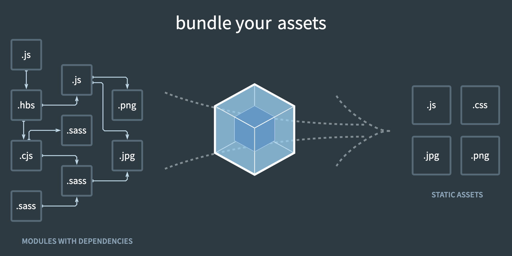

# Webpack의 기본구조

## 1.Module

### 1.1 Module의 종류

1. Built-in Core Module( 예: Node.js module )
1. Communitiy-based Module (예: NPM )
   - npm CLI를 사용해야한다.( 예: npm install ModuleName )
1. Local Module ( 특정 프로젝트에 정의된 모듈 )

### 1.2 Module을 사용한다면

1. 코드의 재사용성이 증가한다.
1. 코드의 관리가 편해지낟.
1. 코드를 모듈화하는 기준이 명확해야 한다.

## 2. Bundle

bundle이란 웹에서 사용되는 다양한 파일들의 모듈들이 서로 참조하게 되는데 이러한 서로 참조 관계에 있는 모듈들을 모아서 하나의 파일로 묶는 것을 Bundle이라고 한다.

### 2.1 Bundle이 중요한 이유

1. 모든 모듈을 로드하기 위한 시간이 단축된다.
   - 한 파일 안에 모든 모듈들이 들어가기 때문에 파일에 접근하는 횟수가 줄어듬
   - 한 파일 내에 모듈을 찾는 속도가 상대적으로 더 빨라져 모듈을 읽어오는 시간이 줄어듬
1. 사용하지 않는 코드를 제거해준다.
   - 번들링을 하게되면 사용되지 않는 함수들을 제거함
   - 필요없는 코드들이 제거되면서 파일 크기가 줄어들어 웹 어플리케이션 최적화에 도움이 됨
1. 파일의 크기를 줄여준다.
   - 필요없는 코드를 제거해서 파일 크기가 줄어들기도 하지만
     별도의 파일들을 압축하는 것보다 파일들이 한 곳으로 번들링된 상태에서 압축되어 파일 크기가 줄어든다.
     <br><br>

# Webpack 이해하기

Webpack이란 웹 어플리케이션을 위해 사용되는 모듈 번들러라는 도구이다.

## 1. Webpack의 기본구조



이미지를 보면 왼쪽에 있는 다양한 파일(모듈)들이 번들링을 통해 오른쪽에 하나의 파일로 묶어진다. 이것을 번들(Bundle)이라고 한다.

### 1.1 Entry

모듈의 의존 관계를 이해하기 위한 시작점을 설정

### 1.2 Output

Webpack이 생성하는 번들 파일에 대한 정보를 설정

src와 dist 폴더를 만들어주고, src 폴더 안에 번들링할 파일들을 넣어주면 index.js를 자동으로 Entry로 설정하고 번들링을 수행하여 dist폴더에 번들링된 파일들이 생선된다.

### 1.3 Bundling

번들링 하는법

- webpack.config.js 파일을 생성 후 아래와 같이 코드를 작성한다.

```javascript
const path = require("path");

module.exports = {
  entry: "./src/index.js", // entry 파일 설정
  output: {
    path: path.resolve(__dirname, "dist"), // output 경로 설정
    filename: "bundle.js", // output 파일 설정
  },
  target: "node",
};
```

- npx webpack 명령어로 번들링한다.

<br><br>

# Mode

1. Package.json, --save-dev, --save
1. 개발환경과 프로덕션 환경
1. Mode & Webpack-merge

## 1. Package.json

1. 어플리케이션 내부에 직접 포함되는 모듈( dependencies )

   - --save

1. 개발 과정에 필요한 모듈( devDependencies )
   - --save-dev

- npm install 명령어로 Package.json 안에 명시되어 있는 모듈들을 설치함
